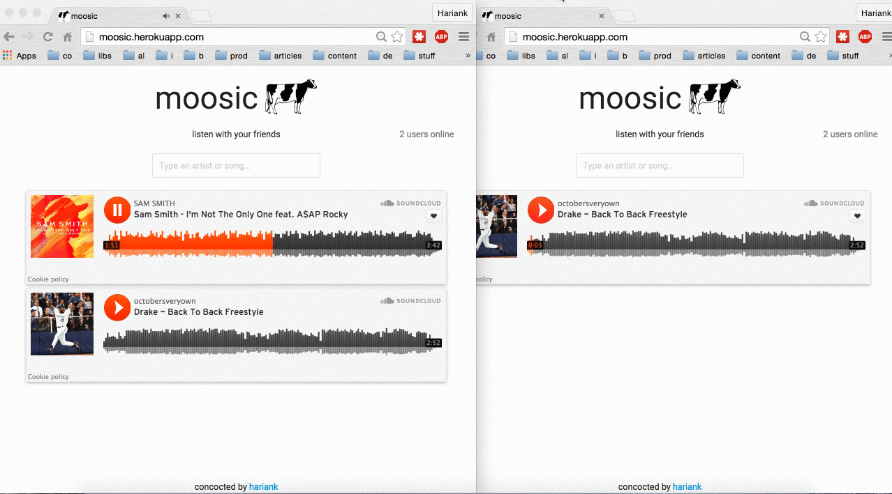

# moosic

Collaborative music listening with Socket.io, Node.js, JQuery, and the Soundcloud API. Instantly add and listen to tracks with your friends in realtime.

http://moosic.herokuapp.com/

Features:
* realtime push to all users
* active user count
* instant soundcloud search
* independent queues

Inspired by [scInstant](https://github.com/karan/scInstant).
